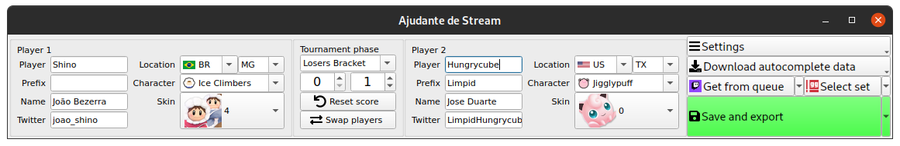

# SmashStreamHelper

A Stream helper for Super Smash Bros Ultimate

Features:
- Update stream information without messing up your OBS setup
- For TOs: select set from SmashGG to have player information automatically filled, update current info from set in StreamQueue, with 100% automatic data input
- For Competitors: turn on Competitor Mode to get your current set info in one click or automatically, so you can play the tournament without needing to manually update the overlay data

# How to install

Windows:

- Download the latest release zip and extract it: https://github.com/joaorb64/SmashStreamHelper/releases/latest
- Install Python 3.X and be sure to have it added to "Path" when installing (Windows x64: https://www.python.org/ftp/python/3.9.2/python-3.9.2-amd64.exe)
- Run `install_requirements.bat`
- Double click `SmashStreamHelper.pyw`

Linux:
- Download the latest release zip and extract it: https://github.com/joaorb64/SmashStreamHelper/releases/latest
- `pip3 install -r requirements.txt`
- `python3 SmashStreamHelper.pyw`

# Usage with OBS

When you click save (or edit anything when auto save is on) a directory named `out` is created in the program's directory, containing the players' data. In OBS, when you create a `Text` element, in its `properties`, there is an option to load the text from a text file. Redirect Text elements to the text files and the images from `out` to have your overlay synced with the program's output.

## Feed me

