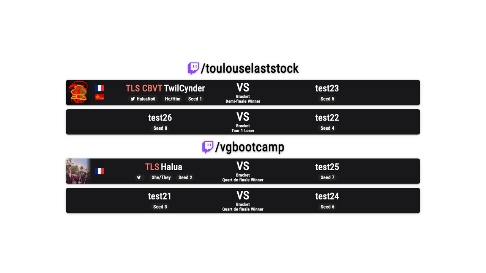

## Stream Queue Layout
(start.gg only, does no work with Challonge)

This layout displays the next matches in the queue for either : 
- The global stream queue of the tournament (matches on all the streams)
- A specific stream (selected in TSH or fixed in the config of this layout)
- A station (selected in TSH)

Here's how it works.

### Select a station, a stream, or all of them
But first, what do i mean by "stream" and a "station" ?
A **station** is, in offline tournaments, a litteral station where you play whatever game your event is on (what's important is that each match is played on one station and each station is running one match a ta time) ; each match can be assigned to a station. Stations are registered in the lower part of the "Stream & Stations" page on start.gg. 
A **stream** is what you define on the top of the "Streams & Stations" page. Basically, it's a twitch/youtube/whatever channel that can be assigned to some matches (a stream is assigned to a match = this match will be streamed on that channel). TSH currently only supports twitch channels, so we refer to streams with just the channel name.  
Note that you can assign a stream to a station, meaning that any match assigned to that station will be implictly assigned to that stream. A stream can be assigned to multiple stations.  

The "**queue**" of a stream or station is the list of matches assigned to that stream or station. The "stream queue" of the tournament is all the streamed sets for all the streams registered and can be viewed in the "Stream Queue" page.  

This layout can display all of these things depending on the following : 
- If you are tracking a stream or station in TSH directly (using the gear icon next to "Track sets from a stream or station"), this stream or station's queue will be displayed
- You can also use the options (either in settings.json or `window.config`, see below) : 
  - The "stream" option will override the stream selected in TSH : if there is a name between the quotes next to "stream", it will display the queue for that stream no matter what.
  - the "default_stream" option does the opposite : a stream name specified here will be used only if there is no stream selected in TSH.  
There is no way to display the queue for an arbitrary station, you can only display the station tracked in TSH.

If you do not specify a stream or station anywhere (nothing in the options and nothing tracked in TSH), the layout will enter global mode, and display sets for the global stream queue.  

Note that in global mode, the name of each stream will be displayed : this can be changed using the [options](#options)  



### Options
Options can be defined in two places : 
- In settings.json, you will find all the options that can change the behavior or this layout. Remember that everything between the `:` next to an option name, and the next `,` (or `}` at the end) will be the value of that option. Values can be numbers (written normally), text (between quotes) and the two special values `true` and `false`, options that are basically a yes/no question. 
- You can makes copies of the .html file, while overriding some options for each file. If you want an overlay that displays the global stream queue, and an overlay that follows what TSH is tracking, you'll want to use two separate copies of the HTML files with different options. To override an option only for a specific .html file, open it, and add a `"option name" : value,` line (same syntax as in settings.json) between the brackets after `window.config`. 
  ```html
    window.config = {
        "OPTION" : VALUE,
    };
  ```

Basically settings.json contains the global options, and if you want to use multiple instances of the layout with different behaviors you copy index.html and use window.config to override the relevant options.  

So, now that you understand options, here are all the possible options and what they do

| Option | Effect
| - | -
| stream | see above
| default_stream | see above
| force_multistream | If `true`, the layout will always be in global mode.
| display_stream_name | If the value is "multistream", the name of the streams will be displayed but only in global mode. If `true`, it will be here even when displaying only one stream. If `false`, never.
| sets_displayed | How many sets are displayed. If -1, no limit, all sets in the queue are displayed, if 0 or more only the first x sets will be listed. 
| display_first_set | if `false`, the first set in the queue will be skipped. Why would you want that ? Well, when a set is started, it stays in the queue, so you may want to only have future sets. 
| minimum_dtermined_players | Sets might have "indermined" players (basically, if you added a set to the stream queue before 2 players qualified for this set). This option limits the display to only sets with a minimum number of players qualified. 2 means only display sets where we know who both players are, 0 means display everything. If the value is below 2, players that aren't determined yet will appear as a big "TBD" (To Be Determined) in the layout.
| station | Remember how you can assign a *station* to a *stream* ? When that's been done for your stream, you can limit the display to only one station. If the value is 2, and stations 1, 2 and 3 are assigned to the stream displayed currently, the matches assigned to stations 1 and 3 will not show up, despite being in the queue for the displayed stream.  *Note : this is different from displaying the queue for a station by tracking that station in TSH. Basically, TSH only pulls the queues for all streams and the station tracked in TSH. If you want to display the station tracked in TSH, it will work even if not streamed. If you use this option, you can target an arbitrary station without tracking it in TSH, but it has to be assigned to a stream, and you need to select that stream using the options.*
| display | This one is special, it's not actually a property, but rather a group of properties. So, you don't change it's value directly (what comes after the : next to "display"), you change the sub-properties inside the brackets next to "display". All these sub-properties are true or false and control whether something is displayed. 
| display.avatar | The player's start.gg avatar.
| display.country_flag | The flag of each player's countries
| display.state_flag | The flag of each player's state/region
| display.station | The station assigned to this set. 

Is there something you don't understand ? A problem with the layout ? Message [@TwilCynder](https://twitter.com/TwilCynder) on twitter or join [TSH's Discord Server](https://discord.gg/X9Sp2FkcHF)